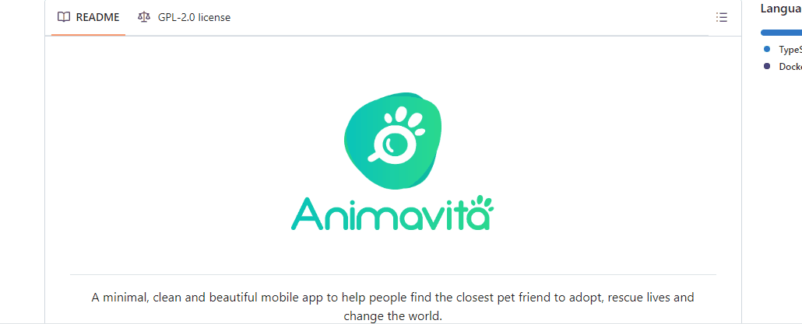

# Projeto teste com README
Um projeto teste com um arquivo README🚀

[]

## Tecnologias utilizadas 
- HTML
- CSS
- JS

## Passos ou comandos a seguir:
- Criar um repositorio no Github;
- Criar uma pasta "localmente", seu notebook;
- Acessar a sua pasta criada "localmente" pelo git bash;
- usa o comando no git bash:
git clone "URL" do repositorio criado no github;
git cd "e o nome do repositorio" para que você entre na pasta do repositorio;
O próximo comando é o;
code . abrirá o VSCODE

Já no VSCODE você poderá colocar imagens, "arrastando" para a basta do seu projeto, e aqui seguindo o seguinte comando irar colocar em seu projeto:

```
[]
```